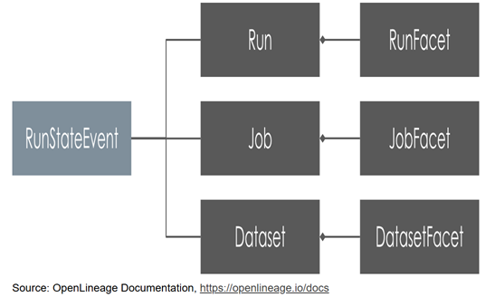
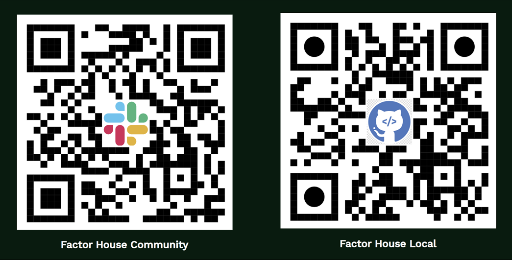

# End-to-End Data Lineage from Kafka to Flink and Spark

     

## Jaehyeon Kim
Developer Experience @ Factor House

---

# What is Data Lineage?

The journey of data - where it comes from, how it’s transformed, and where it ends up.

## Why Data Lineage Matters
* **Debugging & Root Cause Analysis**: Quickly trace issues back to the source.
* **Impact Analysis & Governance**: See what happens if a table changes.
* **Compliance & Audit**: Show data provenance for regulations.
* **Trust & Reliability**: Increase confidence in data products.

---

# What is OpenLineage?

[OpenLineage](https://openlineage.io/docs) is an open standard for capturing lineage metadata from jobs in execution.

## Integrations

Tracks lineage across popular data tools:

* **Airflow / dbt / Great Expectations (data quality)**
* **Flink / Spark / Hive & Trino**
* **Marquez** (visualization & metadata)
* ⚠️ **Kafka** is not an official integration source yet.

---

# Understanding the Two Lineage Paradigms

One answers **"what happened?"** and the other shows **"what is happening right now."**

 

  

  ### Batch Lineage:
  *(Retrospective)*

  - **Data:** Bounded Sets
  - **Lifecycle:** Finite, Scheduled
  - **Capture:** At Job Completion
  - **Result:** Historical Audit Trail

  

  

  ### Streaming Lineage:
  *(Real-time & Operational)*

  - **Challenge:** Unbounded Streams
  - **Challenge:** Continuous Jobs
  - **Opportunity:** Capture **During** Job Execution
  - **Opportunity:** A **Live, Observable System**

  

---

# Lineage for Kafka in Action

Use custom **Single Message Transform (SMT)** as a "pass-through" lineage agent for Kafka Connect

* **How it works**
  - Hooks into the connector lifecycle (`RUNNING`, `FAIL`, `COMPLETE`) without altering data records.
* **Key Feature**:
  - Column-level lineage via Avro schemas in Schema Registry
* **Consistent Namespacing**
  - Creates physical dataset namespaces (``kafka://...`, `s3://...`) for job linking across Flink and Spark.

---

# Flink Jobs

- Native lineage features
- Manual orchestration of lineage events

---

# Spark Pipeline

- Built-in capabilities
- Job linking in practice: namespace alignment and granularity

---

# Conclusion & Best Practices

- Cross-technology insights
- Patterns for implementing lineage effectively
- Final wrap-up and next steps

---

# Let's Get Connected!

 

