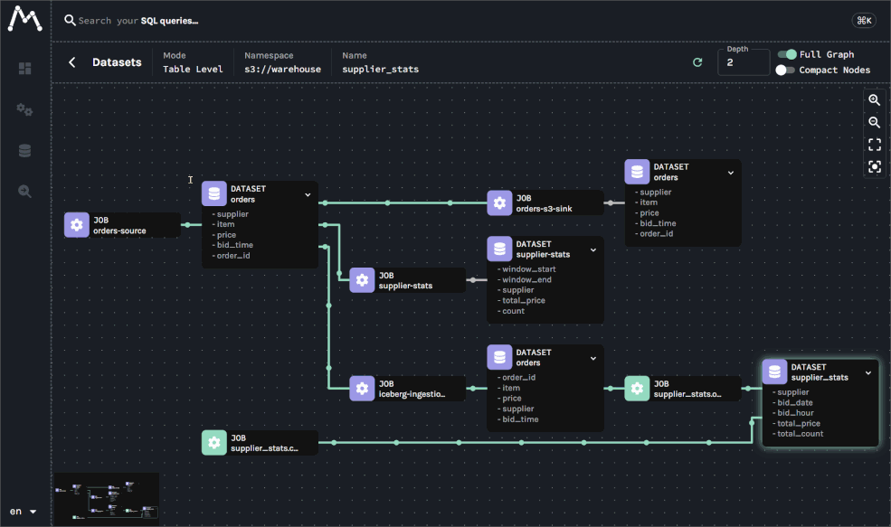
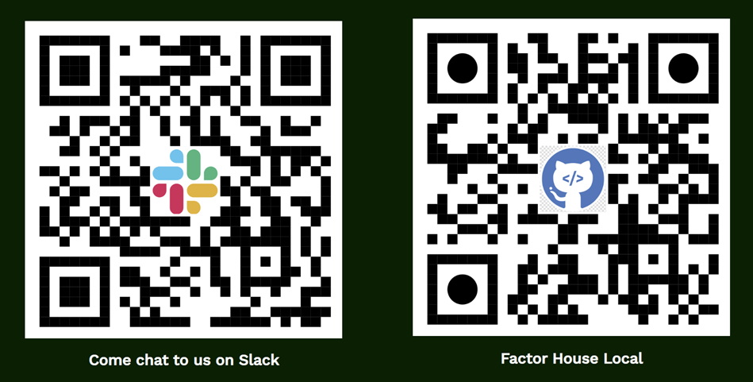

# Building End-to-End Lineage  &nbsp;&nbsp;&nbsp;&nbsp;&nbsp;&nbsp;&nbsp;&nbsp;&nbsp;&nbsp;&nbsp;&nbsp;with Kafka, Flink, and Spark

     

## Jaehyeon Kim

Developer Experience @ Factor House

---

# What is Data Lineage?

The journey of data - where it comes from, how it’s transformed, and where it ends up.

## Why Data Lineage Matters

- **Debugging & Root Cause Analysis**: 
  - Quickly trace issues back to the source.
- **Impact Analysis & Governance**: 
  - See what happens if a table changes.
- **Compliance & Audit**: 
  - Show data provenance for regulations.
- **Trust & Reliability**: 
  - Increase confidence in data products.

---

# What is OpenLineage?

[OpenLineage](https://openlineage.io/docs) is an open standard for capturing lineage metadata from jobs in execution.

It supports integration with popular data tools:

- **Airflow / dbt / Great Expectations (data quality)**
- **Flink / Spark / Hive & Trino**
- **Marquez** (visualization & metadata)
- ⚠️ **Kafka** is not an official integration source.

---

# Understanding the Two Lineage Paradigms

One shows **"what happened"**, the other **"what's happening now"**.

  

### Batch Lineage:

_(Retrospective)_

- **Data:** Bounded Sets
- **Lifecycle:** Finite, Scheduled
- **Capture:** At Job Completion
- **Result:** Historical Audit Trail

  

  

### Streaming Lineage:

_(Real-time & Operational)_

- **Challenge:** Unbounded Streams
- **Challenge:** Continuous Jobs
- **Opportunity:** Capture **During** Job Execution
- **Opportunity:** A **Live, Observable System**

  

---

# Kafka: Enabling Lineage with Connect

Use custom **Single Message Transform (SMT)** as a "pass-through" lineage agent.

- **How it works**
  - Hooks into connector lifecycle (`RUNNING`, `FAIL`, `COMPLETE`) without changing records.
- **Key Feature**
  - Column-level lineage via Avro schemas in Schema Registry
- **Consistent Namespacing**
  - Creates physical dataset namespaces (`kafka://...`, `s3://...`) for job linking.

---

Kafka: One lineage job per connector

---

# Flink: Two Integration Patterns

OpenLineage handles [Flink 1.x and 2.x differently](https://openlineage.io/docs/integrations/flink/about); we use Flink 1.20.

  

### Native `JobListener`:

_(For DataStream API)_

- **Method:** Use `OpenLineageFlinkJobListener`.
- **Pros:** Simple, "out-of-the-box" integration.
- **Cons:** Misses final `ABORT` on cancellation.

  

  

### Manual Orchestration

_(For Table API)_

- **Method:** Use OpenLineage Java client.
- **Pros:** Complete lifecycle tracking including (`ABORT`/`FAIL`).
- **Cons:** Requires more explicit code in the app.

  

---

Flink: One lineage job per application

---

# Spark: Completing the End-to-End Picture

A batch Spark job reads from a Flink Iceberg table and writes to a new one.

- **Method:** OpenLineage Java **agent** via `spark.extraListeners`
- **Discovery:** Auto-detects inputs/outputs from query plan
- **Granularity:** Parent job with child jobs per action

💡 **Namespace alignment** is key

- Upstream jobs (e.g., Flink) must use the same physical NS (`s3://warehouse`).

---

Spark: One lineage job per action

---

# Conclusion: Key Takeaways & Next Steps

  

### Key Takeaways

- **Choose the Right Pattern**
  - Balance simplicity vs. reliability.
- **Align Namespaces**
  - Essential for cross-tech lineage.

  

  

### Next Steps

- **Explore the data lineage labs**
  - See link on the next slide.
- **Start Small**
  - Instrument a single critical pipeline first.

  

---

---

# Let's Get Connected!

