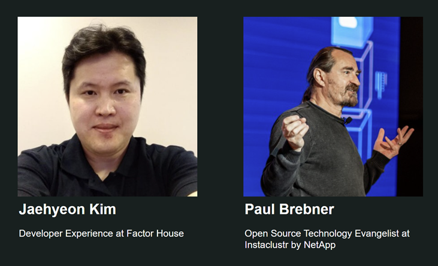
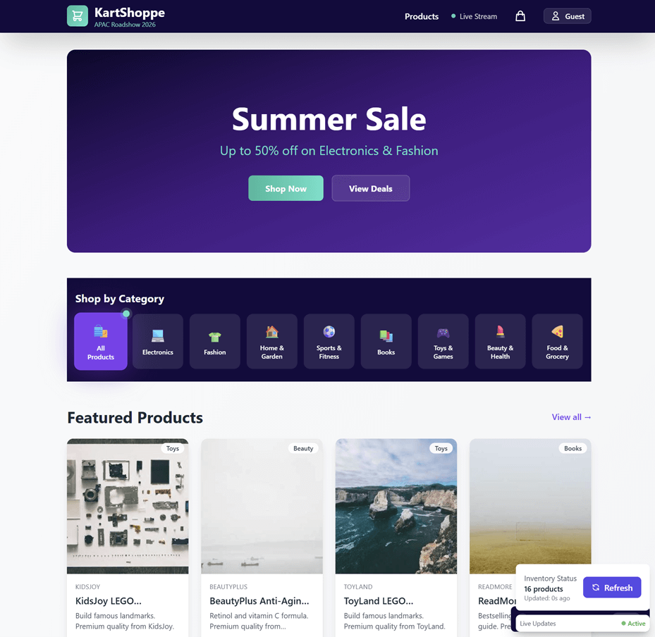
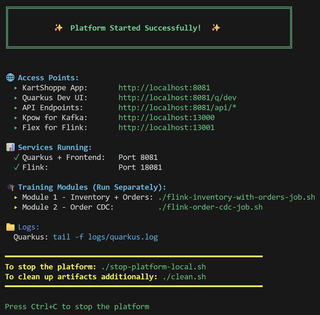
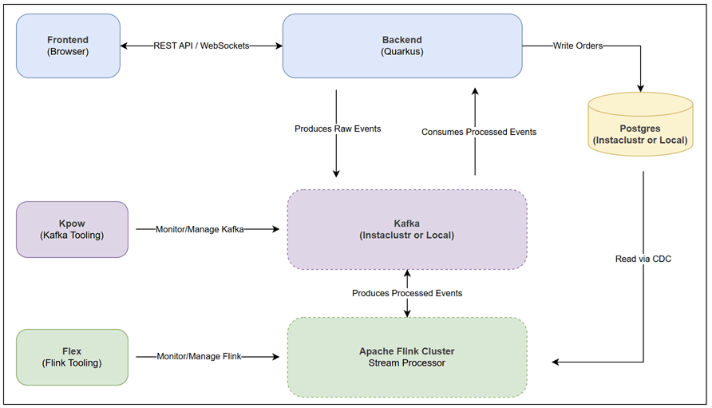
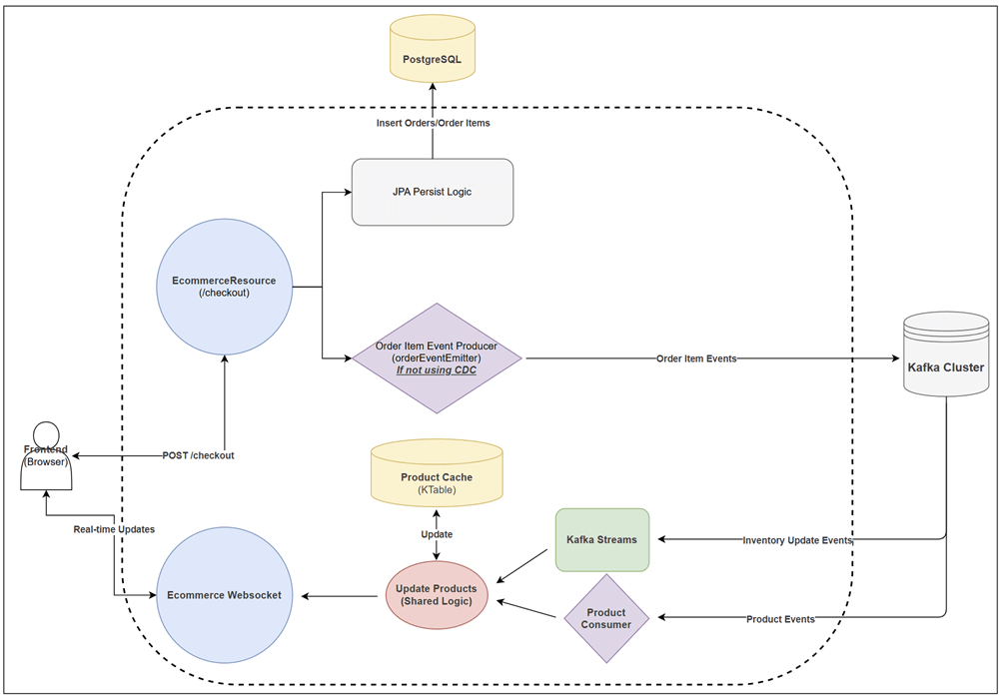
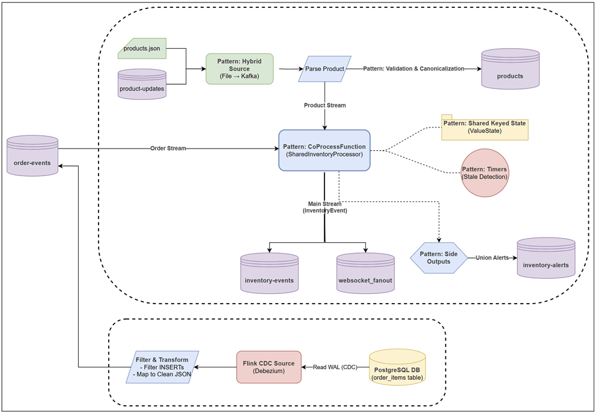
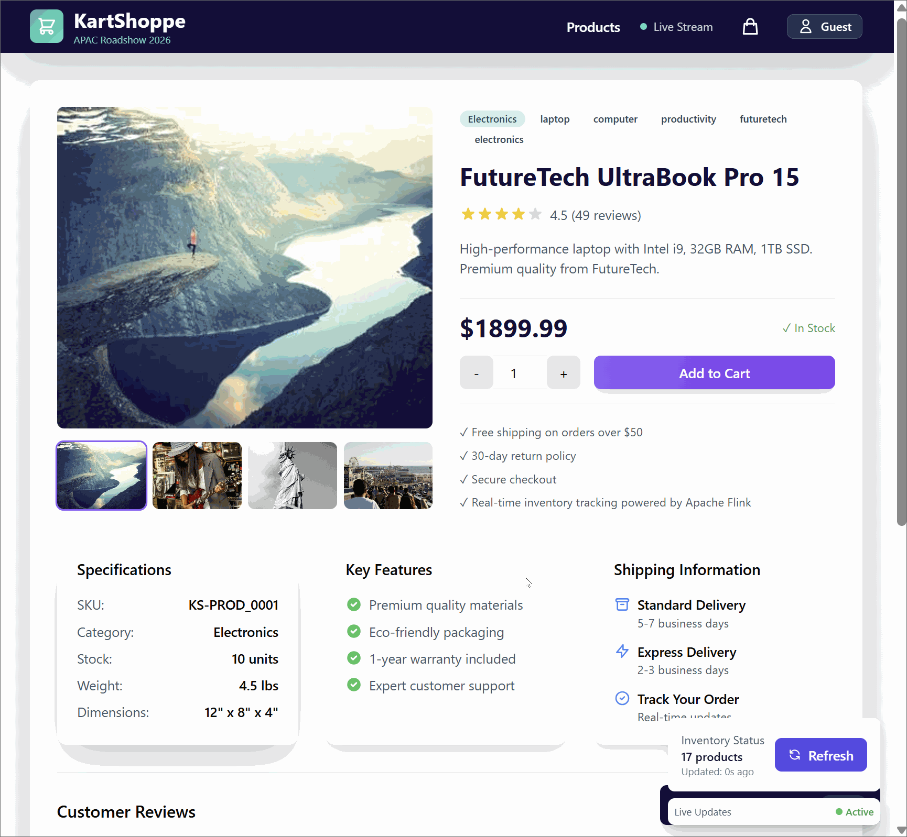

# Building Resilient Event-Driven Systems with Kafka and Flink

    

## Presented by [**Factor House**](https://factorhouse.io/) and [**NetApp Instaclustr**](https://www.instaclustr.com/)

---

# Presenters

---

# KartShoppe 🛒

- **Modern, Decoupled E-Commerce Reference Architecture**
- **Full-Stack: React Frontend, Quarkus, Kafka & Flink**

## Key Learning Objectives

- **Event-Driven Architecture**
- **Reactive Microservices**
- **Apache Flink Fundamentals**
- **Stateful Stream Processing**
- **Database Change Data Capture (CDC)**

---

# Environment Setup

- **Verify Prerequisites**
  - `./setup-environment.sh`
- **Infrastructure Launch**
  - **Kafka Cluster**
  - **PostgreSQL**
- **Factor House Community License**
- **Update `.env` and `application.properties`**
- **Training Platform Launch**
  - `python scripts/manage_topics.py --action create`
  - `python scripts/manage_db.py --action init`
  - `./start-platform-remote.sh`

---

# Live End-to-End Demo

- **Scenario A: Naive Implementation**
  - Real-time state synchronization across user sessions.
  - Powered by Event-Driven Architecture (Quarkus + Kafka).
  - Flink acts as the centralized "Brain" for business logic.
- **Scenario B: CDC Implementation**
  - Establishes Database as Single Source of Truth.
  - Uses Flink CDC to solve the Dual Write problem.

---

# Architecture Overview

- **Quarkus:** The View (Command/Query separation).
- **Flink:** The Brain (Business Logic).
- **Kafka:** The Nervous System (Data Transport).

---

# Backend Deep Dive

- **CQRS (Command Query Responsibility Segregation):**
  - **Write Path:** Async processing via Flink & Postgres.
  - **Read Path:** Instant queries via Quarkus.
- **Event Sourcing:**
  - **Source of Truth:** The Kafka Topic (Log).
  - **State:** Replayed history builds the local **KTable**.
  - **Result:** Zero-latency reads; no database bottlenecks.

---

# Flink Deep Dive

- **Inventory Job (The Brain)**
  - **Hybrid Source:** Bootstraps from File to Real-time (Kafka).
  - **Main Process:** Handles _orders_ and _product updates_ in one stream.
  - **Advanced Patterns:**
    - **Side outputs** for alerts and **timers** to manage expiration logic.
- **Flink CDC (The Safety Net)**
  - Addresses the dual-write challenge.
  - Ensures a single source of truth.

---

# Lab 1 - Native Implementation

- **Setup:** Open **Browser A** (Buyer) and **Browser B** (Incognito/Observer).
- **Action:** User A purchases "_FutureTech UltraBook Pro 15_" (PROD_0001).
- **Reaction:** User B's inventory count drops instantly.
- **Observability:** Switch to **Kpow**. Trace the purchase event using Data Inspect.

---

# Lab 2 - CDC Implementation

- **Action:** Reset inventory using **Kpow** (Data Produce/Edit).
- **Action:** User A purchases the item again while toggling **"Use Flink CDC"** in the UI.
- **Reaction:** Inventory updates exactly as before (Seamless User Experience).
- **Observability:** Switch to **Flex** and inspect Flink jobs.

---

# Key Takeaways

- **Quarkus:**
  - Reactive UI requires separating Reads (WebSockets) from Writes (REST).
- **Flink:**
  - Not just for analytics. It handles core business logic and state.
- **CDC:**
  - Essential for data integrity in distributed systems.
